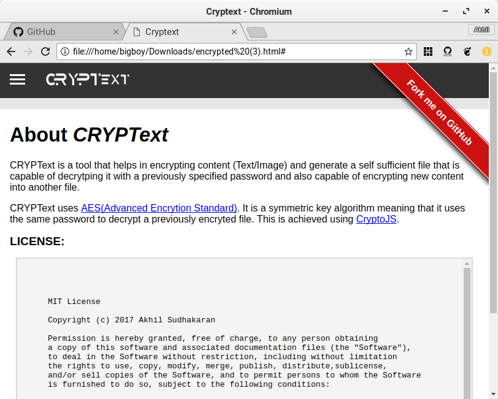

# CRYPText
 

CRYPText is a tool that helps in encrypting content (Text/Image) and generate a self sufficient file that is capable of decrytping it with a previously specified password and also capable of encrypting new content into another file.
CRYPText uses <a href="https://en.wikipedia.org/wiki/Advanced_Encryption_Standard"> AES(Advanced Encryption Standard)</a>. It is a symmetric key algorithm meaning that it uses the same password to decrypt a previously encryted file. This is achieved using <a href="https://code.google.com/archive/p/crypto-js/">CryptoJS</a>.
## Screenshots
       
## Requirements
Any HTML5 supporting web-browser (Preferably Firefox / Chromium web-browser).

## Instructions
Just clone this repo and run the index.html file in the repo. This can be done by exectuting the following commands:

  git clone https://github.com/Akhilsudh/CRYPText.git
  firefox index.html
## License

  MIT License

  Copyright (c) 2017 Akhil Sudhakaran

  Permission is hereby granted, free of charge, to any person obtaining a copy
  of this software and associated documentation files (the "Software"), to deal
  in the Software without restriction, including without limitation the rights
  to use, copy, modify, merge, publish, distribute, sublicense, and/or sell
  copies of the Software, and to permit persons to whom the Software is
  furnished to do so, subject to the following conditions:

  The above copyright notice and this permission notice shall be included in all
  copies or substantial portions of the Software.

  THE SOFTWARE IS PROVIDED "AS IS", WITHOUT WARRANTY OF ANY KIND, EXPRESS OR
  IMPLIED, INCLUDING BUT NOT LIMITED TO THE WARRANTIES OF MERCHANTABILITY,
  FITNESS FOR A PARTICULAR PURPOSE AND NONINFRINGEMENT. IN NO EVENT SHALL THE
  AUTHORS OR COPYRIGHT HOLDERS BE LIABLE FOR ANY CLAIM, DAMAGES OR OTHER
  LIABILITY, WHETHER IN AN ACTION OF CONTRACT, TORT OR OTHERWISE, ARISING FROM,
  OUT OF OR IN CONNECTION WITH THE SOFTWARE OR THE USE OR OTHER DEALINGS IN THE
  SOFTWARE.
