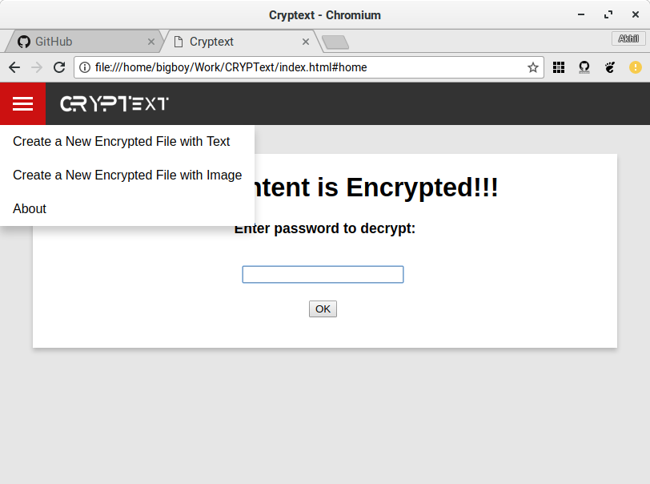
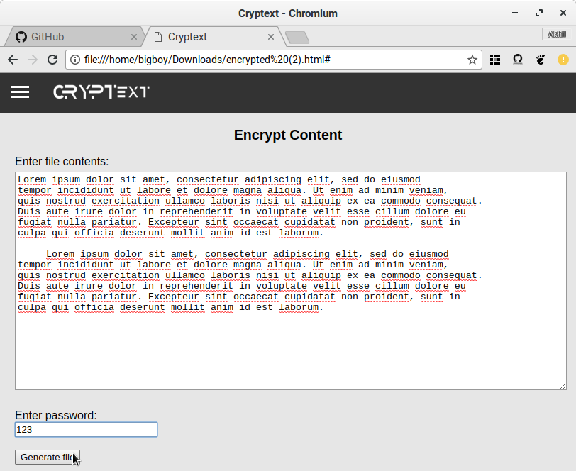
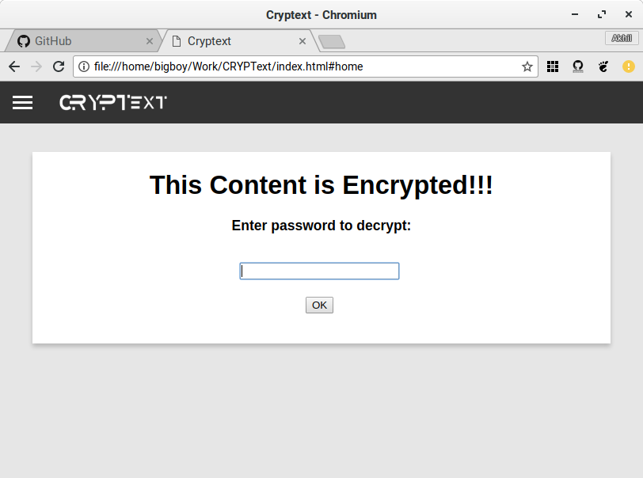
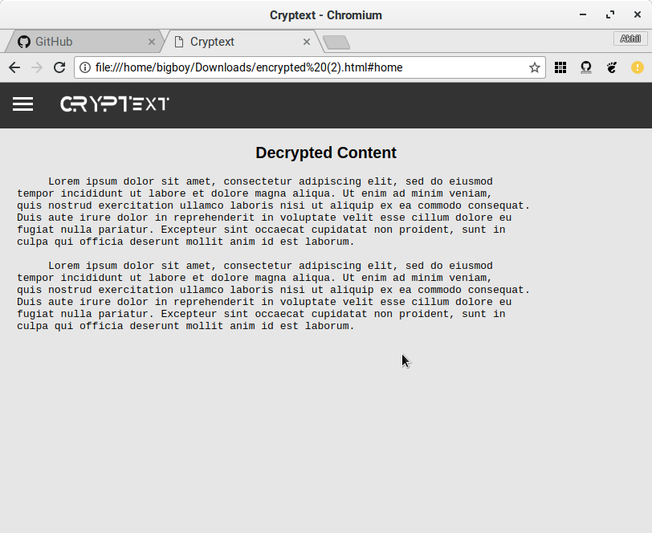
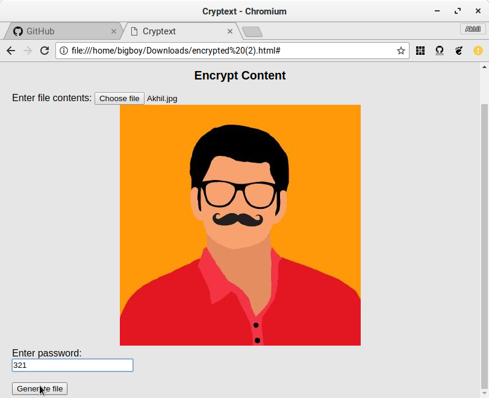
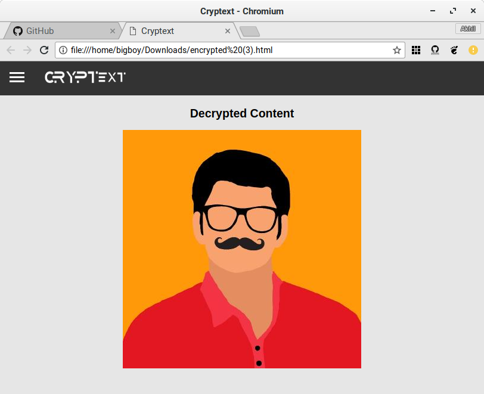

# CRYPText
  

CRYPText is a tool that helps in encrypting content (Text/Image) and generate a self sufficient file that is capable of decrypting it with a previously specified password and also capable of encrypting new content into another file.

CRYPText uses <a href="https://en.wikipedia.org/wiki/Advanced_Encryption_Standard"> AES(Advanced Encryption Standard)</a>. It is a symmetric key algorithm, which means that the same password used to encrypt a file is used to decrypt it. This is achieved using <a href="https://code.google.com/archive/p/crypto-js/">CryptoJS</a>.

## Requirements
Any HTML5 supporting web-browser (Preferably Firefox / Chromium web-browser).

## Instructions
Just clone this repo and run the cryptextApp.html file in the repo. Select the necessary option to either encrypt text or a picture:

### Text encryption

- Incase of encryting text, enter the content in the edit box and specify the password to encrypt it. This will generate another `.html` file that you could share.

- This `.html` file would promt a password
 

- Upon entering the contents of the encrypted file would come up like this:

### Image encryption

- Incase of encryting images, upload the image and specify the password to encrypt it. This will generate another `.html` file that you could share.

- This `.html` file would promt a password
 

- Upon entering the contents of the encrypted file would come up like this:

